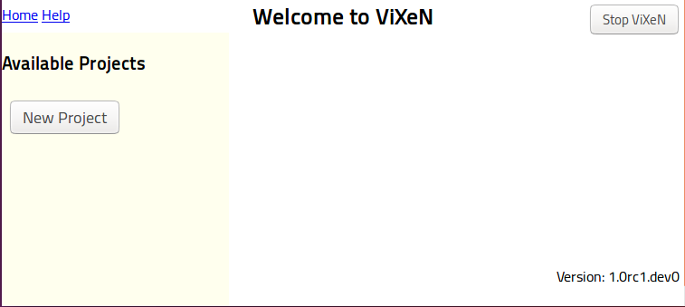
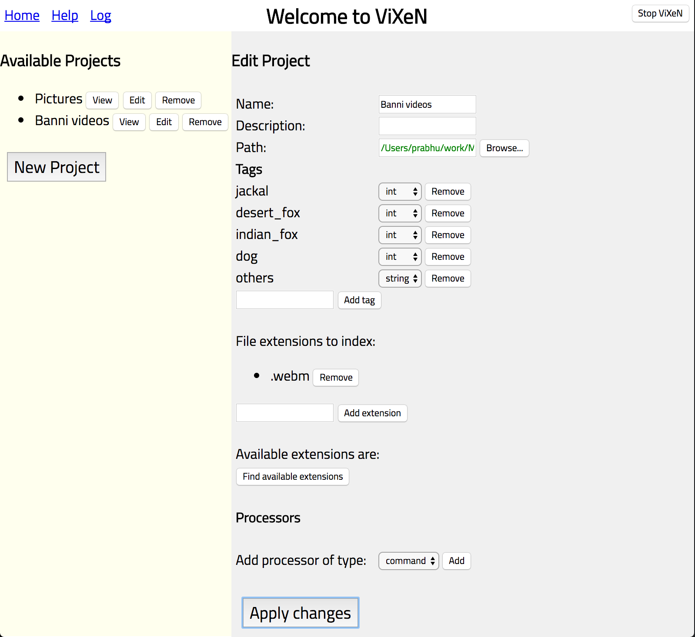
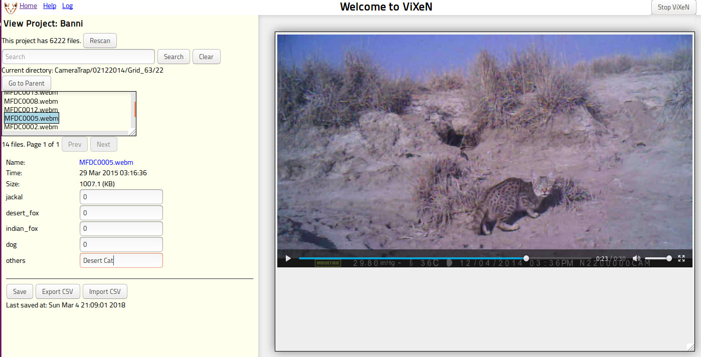

.. _using-vixen:

=============
Using ViXeN
=============

This is a simple tutorial on how to get started using ViXeN and its features.

When you first start the application it should open a new page on your default
browser. If this is not a supported browser, you can simply copy the URL on
the location bar onto a supported browser such as Chrome or Firefox and the UI
should load correctly.

When you first start you will have a rather empty page with an button on the
left panel to create a new project as seen in the figure below:

   Start page when ViXeN is started for the first time.

In the figure, on the top right is a button to stop the ViXeN application.
Clicking on this will close ViXeN and one may safely close the browser tab.
The top left has three links, "Home", "Help", and "Log" the home link brings
the user to the page where one can edit or view the different projects. The
help link takes a user to the documentation. If you are using a binary, this
will take one to a copy of the documentation bundled with the binary. The
"Log" shows the vixen application logs in a separate tab. This is handy if you
are running into errors and is useful when you are reporting problems.

Setting up a project
--------------------

Create a new project by clicking on "New project". Fill in the fields of the
project on the right side. An example of this can be seen in the figure below.

   Adding a new project and setting it up.

The important fields to fill are:

- Name: set this to a suitable name for your project.

- Path: this is the path to the root of your media files that you wish to
  index. Click on "Browse..." to choose the directory from a file browser. You
  may also directly type the directory path on the text box. All files inside
  this directory can be "indexed". You may choose to index only specific
  extensions by adding specific extensions on the field below the "Tags" field.

- Tags: this is a very important field. These define the various metadata tags
  associated with your media. You may add as many fields as you desire. A tag
  can be either a string, integer, float, or boolean. For each media file, you
  will be able to change/edit these fields when viewing the project. You can
  add multiple tags in one go by separating them with commas, for example:
  fox, jackal, dog. Once added you can change the type of the tag on the UI.
  You can add and remove tags later on also. One default tag is always added
  called "completed" you may remove it without any loss of functionality if
  you do not need it.

- File extensions to index: this defaults to all extensions, you may specify
  any extensions you specifically wish to index. For example specifying
  ``.png, .jpg`` and clicking on the "Add extension" will index only the png
  and jpg files. The button, "Find available extensions" will show you a list
  of all extensions inside the specified path.

- Processors: You may add a variety of processors that allow you to either
  convert your media, copy your media, add tags using Python scripts, or use
  an external program to add tags. This is discussed in greater detail in the
  section :ref:`processing-media` below.  Processors are entirely optional.

Once you have setup the project, simply click on "Apply changes" for ViXeN to
quickly scan all the files and make its internal database. Depending on the
size of your directory, this should take a few seconds. Once this is done, you
can click on the "View" button on the left pane to view the media.

If you do not need a project anymore, you may simply click on the "Remove"
button remove the project. This will remove only the metadata, your media will
be untouched.

Note that when the files are indexed the following tags are always available:

- ctime: date: creation date/time of the file.
- mtime: date: modified date/time of the file.
- path: string: the full path of the file.
- relpath: string: the relative path to the file with respect to the project root.
- size: int: the file size in bytes.
- type: string: the type of the file (video, audio, image, html, pdf, etc.)

Viewing media
--------------

The view interface is very simple and divided into two parts. An example view
is provided in the following figure.

   Viewing a project on ViXeN.

On the left side you will see a simple directory browser. Clicking on a
directory (shown typically in bold with a trailing '/') will navigate into
this directory and clicking on a file will display the media on the right side
of the page. Below the directory browser, the metadata tags of the media file
are shown. One may edit the tags as one sees fit.

On the right side, the media file is shown. Any file format that the browser
can render is typically shown currently this works for videos (webm, ogg
theora video), image files ('.png', '.jpg', '.gif', '.svg' etc.), audio files
('.mp3', '.m4a', '.ogg', etc.), HTML, text, and PDF. The rendering is really
dependent on the browser and your platform.

If the browser does not support the media but your operating system does, you
can open the file with the system viewer by clicking on the "Name" field of
the media on the left panel. This is typically shown as a blue link. This will
open the file using the operating system's registered viewer for the
particular file.

ViXeN thus makes it easy to view the data on the right and update the metadata
for each file.

.. note::

   It is important to remember to save the project after changing the
   metadata. This can be done by pressing the "Save" button or pressing
   "Command+S" or "Control+S".

Keyboard shortcuts for navigation
----------------------------------

While navigating the directory browser, there are a few useful keyboard
shortcuts:

- Pressing "h" or the left arrow key will go to the parent directory.
- "k", "n", or the "down" arrow key will go to the next file,
- "j", "p", or "up" arrow will go to the previous file/directory,
- "l", "enter", or the right arrow key will either select/view the file or
  navigate into a sub-directory.
- "Command+s" or "Control+s" will save the project.

Searching
-----------

One powerful feature with ViXeN is the ability to search through the metadata.

By default searching for a string in the search box and pressing return/enter
or pressing the search button will search for the occurrence of the string in
the full path of the media file.

To search for specific tags, let us consider an example project with the
metadata tags "fox" (an integer), "jackal" (an integer), and "others"
(string).

- To find all the media which have a single fox, one types: ``fox:1``
- To find all the media which greater than one fox, one types: ``fox:>1``
- To find all the media which greater than one fox or one jackal, one types:
  ``fox:>1 OR jackal:1``
- To find all the media where the "others" tag has a gerbil one types:
  ``others:gerbil``.
- To find all the media where there is a gerbil and a single jackal one types:
  ``jackal:1 AND others:gerbil``
- To find the occurrence of the text "desert cat" in the "others" tag one
  types: ``others:'desert cat'``. Note the use of the single quotes.

In addition, one may also search by the time of the media. Each media file's
creation time (``ctime``) and modified time (``mtime``) are also indexed
automatically.  One can search for the time as follows:

- for all images modified in 2015: ``mtime:2015``,
- for all images modified in 2015 January: ``mtime:201501`` or ``mtime:'jan
  2015'``.

ViXeN uses whoosh_ to parse the query string. For more details on the query
language see the `date parsing documentation
<https://whoosh.readthedocs.io/en/latest/dates.html>`_.

.. _whoosh: http://whoosh.readthedocs.io

Exporting the tag information to a CSV file
--------------------------------------------

Once the tags have been entered one can export the metadata to a CSV file.
Simply click on the "Export CSV" button and you will be prompted for a file.
This file will contain all the tags for the data.

Importing tag information from a CSV file
------------------------------------------

One may also import tag information from a CSV file. Click on the "Import CSV"
button, supply a file and it will import the tags. The CSV file must have a
"path" column which should be exactly the same path as the corresponding media
file. If there is a doubt as to what path is stored by Vixen, export the
project data to CSV and look at the path column.

It is important to note that only tags that have already been defined in the
project will be imported. The column name of the CSV file should match the tag
name exactly. Any columns which do not have corresponding tags will not be
imported.

Finally, after importing the tags, one must save the project to have the
changes be stored to disk.

.. _processing-media:

Processing media files
----------------------

One can process media files in a variety of ways. When editing a project, one
can add processors.  The following processors are available.

- Command: run a user-defined command on the media files. Useful for format
  conversions.
- Tagger: run a user-defined program to tag the media.
- Python: call a user-defined Python function to do whatever desired.

The processors are described in greater detail below. One can add a processor
and test it on a single file to see if it works correctly and then process the
entire set of files. Always remember to save the project after the processing
has completed and the results are satisfactory.

Note that if you have any search results and then run the processing, it will
run the processing only on the searched files.

The Command processor
~~~~~~~~~~~~~~~~~~~~~~

This processor allows the user to run an arbitrary command on the media. This
is typically used to perform file format conversions. For example, if one
wishes to convert an unsupported video with the extension ``.avi`` file to a
``.webm`` file, one may use ffmpeg_. To run ``ffmpeg`` on the media, one
simply adds a command processor and sets the "command" field to: ``ffmpeg -i
$input $output`` and set the input extension field to ``.avi`` and the output
extension to ``.webm``. The following important attributes should be set:

- Destination path: One should set the destination path to either the same
  directory as the source or to any other directory.
- Mirror tree: This option allows one to mirror the source tree of files
  into another location. It is best to leave this as the default.
- Copy timestamps: ensures that the converted file has the same timestamps
  as the original, this is useful when searching using the dates as this
  option preserves the original file's timestamps.

The Tagger processor
~~~~~~~~~~~~~~~~~~~~

Allows the user to run an arbitrary program to set the tags of the media. The
tagger program is passed the full path to the media file. It should print out
the tag information on standard output. For example, let us say we have a
program called ``tagger``, when ``tagger`` is supplied a path, it should print
out the following::

    $ tagger /path/to/image.png
    fox:1
    temperature:25
    completed:True
    $

Each line should correspond to an existing metadata tag of the project. This
output is automatically parsed and the media tags are updated with these
values. The tagger processor in the above case should be configured with the
``command`` set to ``tagger``. The input file argument is automatically
passed.

As another example of how one can extract EXIF information and populate
specific tags (on OS X or Linux), one may do the following. First make sure
Imagemagick_ is installed, specifically the ``identify`` command is working.
Then create a small script, lets call it ``extract_exif.sh``::

    #!/bin/bash
    identify -verbose $1 | grep exif | cut -d ':' -f 2-

The second line takes the input file, and selects only the exif information.
Make sure this script is executable::

    $ chmod a+x extract_exif.sh

When this script is executed as follows, it prints the following::

  $ extract_exif.sh /path/to/image.jpg
  GPSAltitude: 0/1
  GPSAltitudeRef: 0
  GPSDateStamp: 2012:07:27
  GPSInfo: 356
  GPSLatitude: 12/1, 56/1, 3333/100
  GPSLatitudeRef: N
  GPSLongitude: 77/1, 35/1, 5106/100
  GPSLongitudeRef: E
  [...]

One can add a tagger processor and set the command to the full path of this
script. Now when one runs the processing, if you have defined any of the tags,
for example if a tag called ``GPSDateStamp``, ``GPSLatitude``, and
``GPSLongitude``, then those fields will be extracted and saved in your
metadata. This allows you to save only fields that are relevant to your work.

The tagger can be implemented in R or Python for example. In case this is a
Python script one may wish to set the command to ``/path/to/python
script.py``. ViXeN will simply pass the file to this script at the end.

The tagger processor can be more complicated than this and do a lot more but
this should give you an idea of the power of this approach.

.. _Imagemagick: https://www.imagemagick.org/

The Python processor
~~~~~~~~~~~~~~~~~~~~

This processor allows the user to run arbitrary Python code to set the media
tags. This requires knowledge of Python and the ViXeN API but is relatively
simple. A simple example is provided below to illustrate the ideas. Let us
assume that the following example code is typed into the text box::

    import os.path
    def process(relpath, media, dest):
        media.tags['parent'] = os.path.dirname(media.path)
        media.tags['comment'] = '%s bytes' % media.size
        media.tags['completed'] = True

The function is passed three arguments. The ``relpath`` is the relative path
to the media file. The ``media`` instance is the actual media object
associated with the media file. The media object has a ``path`` attribute, it
also has a ``tags`` attribute which is a dictionary with the keys as the tags
for the media. Thus, ``media.tags['parent']`` is the ``parent`` tag.
``media.size`` is the size of the file in bytes. The above example is a
trivial one, one can write arbitrary Python code to process the tags or run
external programs if desired. This processor does require reasonable knowledge
of Python programming. What it does do is provide a powerful mechanism for
scripting the metadata using Python.

.. _ffmpeg: http://ffmpeg.org
