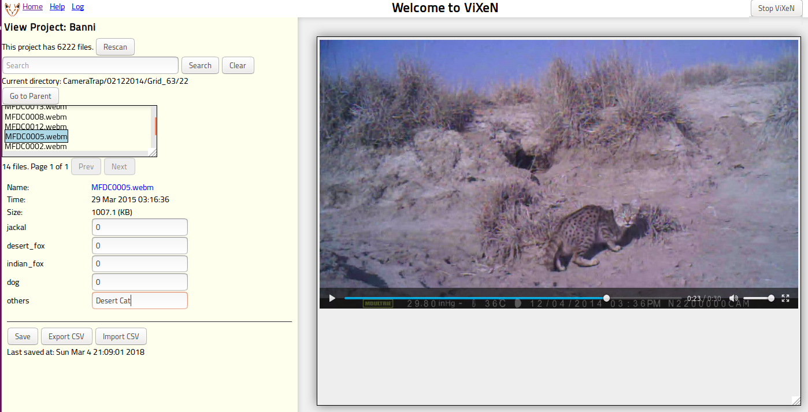
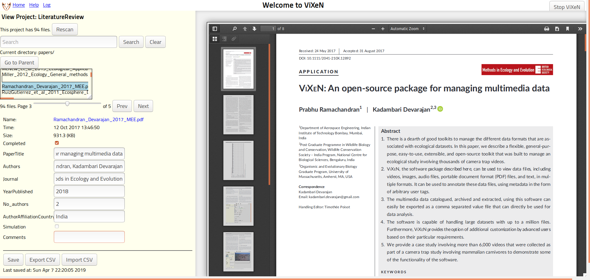

# Summary

ViXeN is a simple and general-purpose media metadata management tool. The name
ViXeN is an acronym for View eXtract aNnotate, and the tool can be used for
viewing, extracting information from, and annotating media files. Consider the
case where one has a collection of images and would like to associate some
arbitrary metadata with each image. This might be for identifying or counting
the people, location, species, or objects in each image. This is a
surprisingly common requirement. Another application is assigning metadata to
portable document format (PDF) files that are part of a literature review or
meta-analysis. ViXeN offers an unobtrusive and intuitive way of managing such
metadata for a variety of media. ViXeN is browser-based and hence capable of
displaying any files that the browser supports. This includes most image
types, text, html, videos, audio, and PDFs.

ViXeN allows a user to create an arbitrary number of metadata fields. Each
field can take the form of a boolean, integer, float, or free form text. These
fields are conveniently displayed adjacent to the media allowing the user to
rapidly edit metadata while viewing the file. This is important since entering
this information in a spreadsheet is not very convenient and quite
error-prone. We have used ViXeN to annotate camera trap videos, camera trap
images, and for a literature survey where metadata from academic papers was
collected. The metadata is not stored along with the files but in a separate
file. The original files are not modified, thereby making ViXeN completely
non-invasive. The figure below shows a camera trap video being annotated using
ViXeN. The figure below this shows a PDF file being viewed and annotated.

Users can search the indexed media using a simple but powerful search
interface. The metadata may also be exported into a comma separated value
(CSV) file for further processing by the user. Metadata from a CSV file can
also be imported into ViXeN. ViXeN provides a simple mechanism for users to
process the files using any command-line utilities. This is often useful when
the files are not supported by the browser and need to be reformatted. In
addition, one can also use any program to automatically assign the metadata.
The programs simply need to process each file and write the metadata
information to standard output in a simple form and this will be automatically
assigned. For example, a user could write an R or Python script that computes
a metadata attribute of interest, then the script would accept a file path and
print out the metadata tag followed by the value. This metadata could then be
immediately ingested by ViXeN.

ViXeN is implemented in Python and provides a browser-based user interface
(UI). ViXeN can either be installed via ``pip`` or can be installed as a
standalone executable making it very easy to install. It works with both
Python 3.x and Python 2.7.x. The installer is created using PyInstaller and
creates a small package that is less than 20 MB in size on Linux, Windows, and
MacOS.

ViXeN uses the [traits](https://github.com/enthought/traits) package to define
its model objects and uses the [jigna](https://github.com/enthought/jigna)
package to present a HTML based user interface that renders on a browser. The
HTML UI uses the ``vue.js`` package and custom CSS. A
[``tornado``](https://www.tornadoweb.org) server hosts the web application and
displays this locally on the browser. ViXeN works well with Firefox, Chrome,
and Safari, as well as with IE 9 and above. Thanks to the
Model-View-Controller based (MVC) design of ViXeN, it has a test coverage of
88%. The documentation of ViXeN is hosted at https://vixen.rtfd.io. The
documentation is also bundled with the binary installers so users can view the
documentation even if they do not have internet access.

The publication[@vixen:2018] discusses ViXeN in considerable detail in the
context of camera trap videos used for ecological studies.

# Acknowledgements

We are grateful to Kamal Morjal for the CSS layout of the UI and Khushalsingh
Rajput for his help in digitizing the ViXeN logo.

# References
